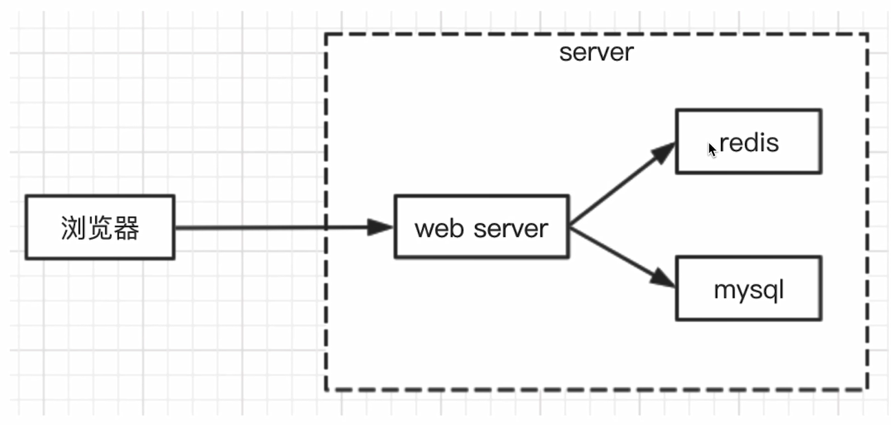

## 浏览器输入url会发生什么
DNS解析，建立TCP连接，发送http请求
server接收到http请求，处理，并返回客户端接收到返回数据，
客户端处理数据（如渲染页面，执行js）

## TCp为啥需要三次握手
为了确保服务端和客户端都能确认对方收得到信息

## 启动一个服务
```JS
const server = http.createServer((req, res) => {
// 做路由和数据处理
});
```

## 数据存储——mysql

安装
```node
npm i mysql
```

NODE链接
```JS
const mysql = require("mysql")
// 创建链接对象
let MYSQL_CONF = {
  host: "localhost",
  port: "3306",
  user: "root",
  password: "123456",
  database: "myblog"
}
// 链接数据库
const con = mysql.createConnection(MYSQL_CONF);
// 数据库查询操作
con.query(sql, (err, res) => {
```

## 登录功能实现

### cookie
- 存储在浏览器的一段字符串（最大5kb）
- 跨域不共享
- 每次发送http请求，会将请求域的cookie一起发送给server
- server可以修改cookie并返回给浏览器
- 浏览器中也可以通过javascript修改cookie（有限制）

查看cookie
```JS
document.cookie
```
设置cookie，会自动累加
```JS
document.cookie = "a=2"
```

### session
- cookie里直接带有用户信息太不安全
- 使用一个变量将用户id存起来，不暴露过多用户信息
  
缺点：
- 进程较多的时候，需要存多份session
- 与sever的内存在一起，相互影响

### redis
- web server最常用的缓存数据库，数据存放在内存中
- 相比于mysql，访问速度快（内柠和硬盘不是一个数量级的）
- 但是成本更高，可存储的数据量更小（内存的硬伤）,断电就没了
- 将web server和redis拆分为两个单独的服务，双方都是独立的，都是可扩展的（例如都扩展成集群）

为什么session适合redis
- session访问频繁，对性能要求极高
- session可不考虑断电丢失数据的问题（内存的硬伤）
- session数据量不会太大（相比于mysql中存储的数据）

分离后的服务端


```JS
const redis = require("redis");
REDIS_CONF = {
    port: 6379,
    host: '127.0.0.1'
}
// 链接redis
const redisClient = redis.createClient(REDIS_CONF.port, REDIS_CONF.host)
redisClient.on("error", (err) => {
  console.log(err)
})
// 操作redis
redisClient.set(key, value, redis.print)
redisClient.get(key, (err, val) => {})
```

## 日志


### stream
文件读取IO
```js
const readstream = fs. createReadStream (fileNamel)
const writestream = fs. createWritestream(fileName2)
readstream. pipe(writestream) 
```

网络IO
```JS
const readstream= fs.createReadstream(fileName1)
readstream.pipe(res) // 将读取的文件作为response返回；res也可如此操作
```

### 日志拆分
- 日志内容会慢慢积累，放在一个文件中不好处理
- 按时间划分日志文件，如2021-02-10.access.log
- 实现方式：linux的crontab命令，即定时任务

### 日志分析——readline

## 安全

### sql注入
- 攻击方式：在输入区域输入一个sql片段，最终拼接成一段攻击代码
- 预防措施：使用mysgl的escape函数处理输入内容即可

```JS
const escape= mysql.escape
username = escape(username)
password = escape(password)
```
### xss攻击——跨站脚本攻击
- 攻击方式：在页面展示内容中掺杂js代码，以获取网页信息
- 预防措施：转换生成js的特殊字符
```
npm i -xss
```
```js
const xss = require('xss')
const title = xss(blogData. title)
```

### 密码加密
- 攻击方式：攻破数据库，获取用户名和密码，再去尝试登录其他系统
- 预防措施：将密码加密，即便拿到密码也不知道明文

```JS
const crypto = require('crypto')
//密匙
const SECRET_KEY = 'WJiol 8776#'
//md5加密
function md5 (content) {
  let md5 = crypto.createHash('md5')
  return md5.update(content).digest('hex')
}
//加密函数
function genPassword (password) {
  const str = `password=${password}&key=${SECRET_KEY}`
  return md5('str')
}
```