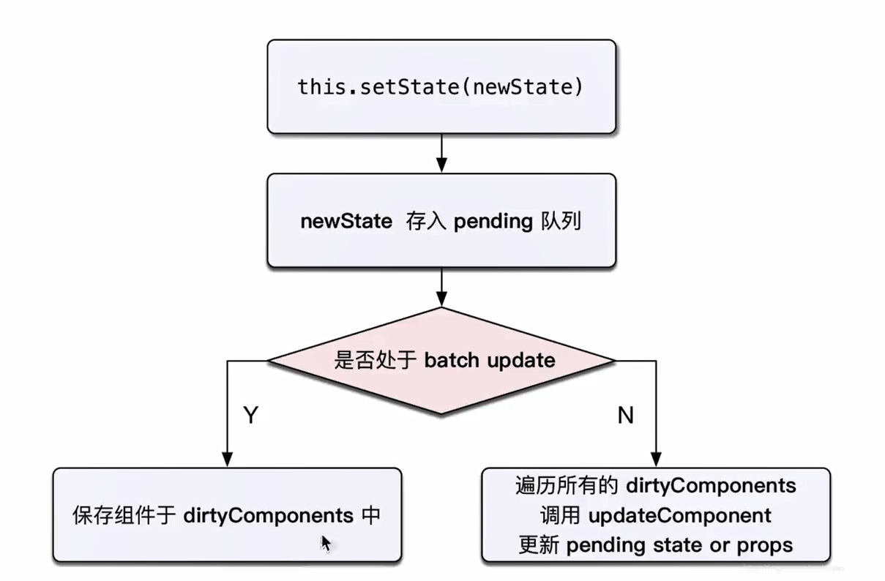
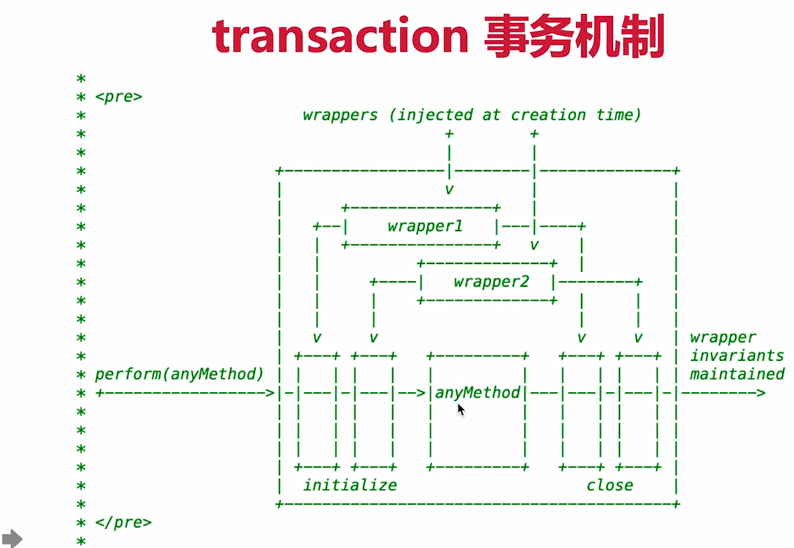
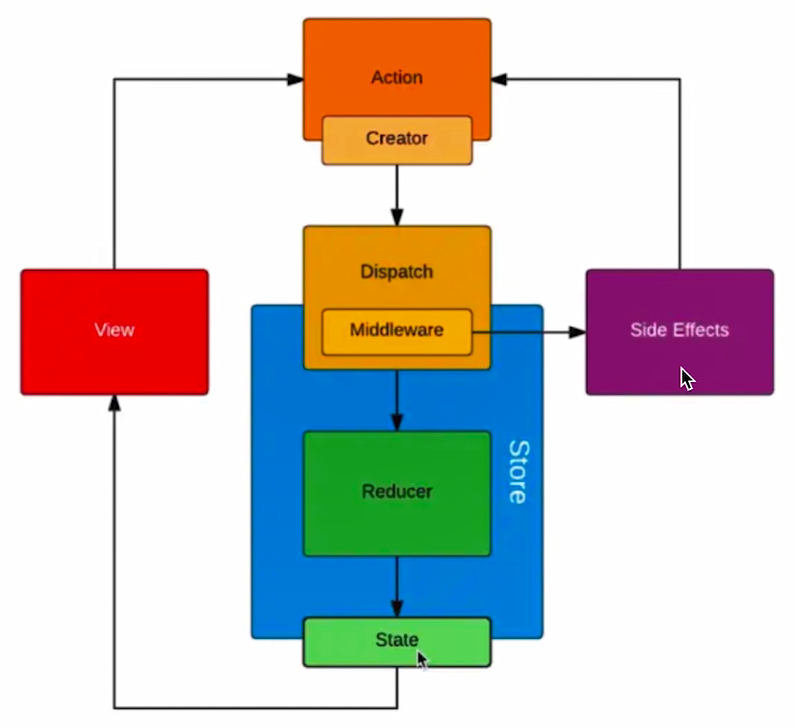

## React

## Vdom 和 diff 算法
- h函数
- vnode数据结构
  虚拟DOM就是一个JS对象
  ```HTML
  <div id="vm">
      <span>Hello World</span>
  </div>
  ```

  ```JS
  {
      tag："div"
      props:{
          id:"vm"
      },
      children:[{
          tag:"span",
          props:{},
          children: "Hello World"
      }]
  }
  ```
- patch函数
  只比较同一层级，不跨级比较
  tag不相同，则直接删掉重建，不再深度比较tag和key，两者都相同，则认为是相同节点，不再深度比较

## react 事件
- 所有事件挂载到document上[17后会绑定到root组件上] 【避免内存消耗和加解绑；方便同一管理】
- event不是原生的，是SyntheticEvent合成事件对象[更好的兼容性和跨平台；]
- 和Vue事件不同，和DOM事件也不同

## setState  和 batchUpdate机制
- 有时异步（普通使用），有时同步（setTimeout，DOM事）
- 有时合并（值为对象形式），有时不合并（值为函数形式）




## react fiber
JS是单线程的，react DOM的时候可能会阻塞页面的用户操作
patch操作分为两个阶段（reconciliation[diff]，commit[dom渲染]）
- 将reconciliation阶段进行任务拆分（commit无法拆分）
- DOM需要渲染时暂停，空闲时恢复
- window.requestIdleCallback


## React面试题

### 组件之间如何通讯
1. 父子组件的props
2. 自定义事件
3. reudx[复杂的信息]和context[简单的信息]

### JSX的本质
1. createElement
2. 执行返回Vnode

### context是什么
1. 父组件，向其下所有子孙组件传递信息
2. 如一些简单的公共信息：主题色、语言等
3. 复杂的使用redux

### shouldComponentUpdate用途
1. 性能优化
2. 配合“不可变值”使用
3. 浅比较
   
### setState 是同步还是异步


### react事件和DOM事件的区别


### React 和 Vue 的区别
共同点：
- 都支持组件化
- 都是数据驱动视图
- 都使用vdom操作DOM
  
不同点：
- React使用JSX拥抱JS，Vue使用模板拥抱html
- React函数式编程，Vue声明式编程
- React更需要自力更生，Vue把想要的都给你

## Redux面试题

### redux 单向数据流


## React-router
- 路由模式（hash，H5 history）
  ```js
  HashRouter
  BrowserRouter
  ```
  hash模式（默认），如http://abc.com/#/user/10
  H5 history模式，如http://abc.com/user/20Q
- 路由配置（动态路由、懒加载）
  ```Jsx
  <Route path="/project/:id">
    <Project />
  </Route>
  ```
  ```JS
  import React, { Suspense, lazy } from 'react';
  const About = lazy(() => import('./routes/About'));
  <!-- Suspense 处理白屏loading -->
  ```