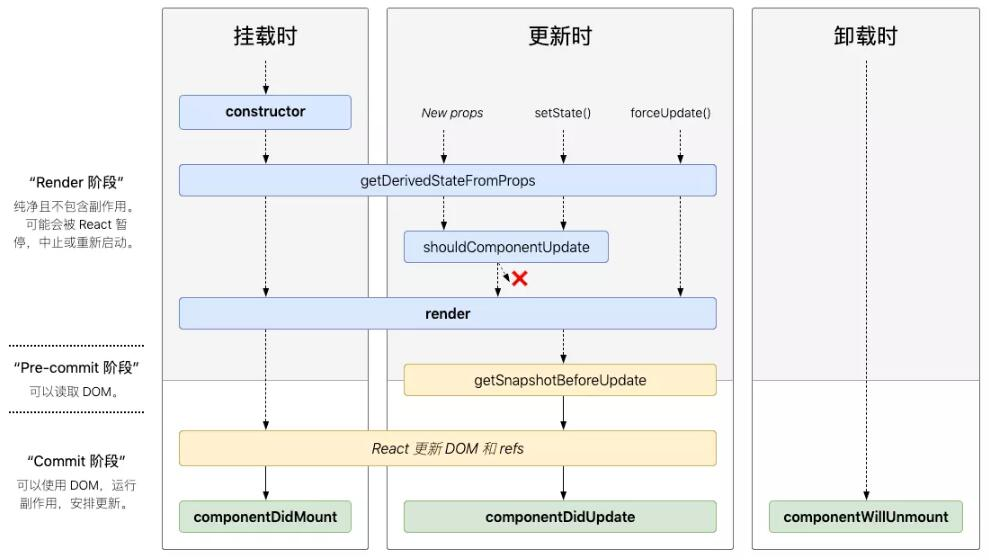

# react语法 回顾

## 生命周期函数
1、初始化（Initialization）
2、挂载（Mounting）
    a、componentWillMOunt
    b、render
    c、componentDidMount
3、更新（Updation）
    a、componentWillReceiveProps: 当接受的props改变时会触发（第一次渲染不会执行）
    b、shouldComponentUpdate：当state和props改变时会触发
    c、componentWillUpdate
    d、render
    e、componentDidUpdate
4、卸载（Unmounting）
    a、componentWillUnmount


## diff算法
1、同级比较，不同则更改后级所有的DOM
2、key值比较，实现对应比较，而不是按照顺序比较，所以要才用唯一且不变的值作为key

## 虚拟DOM
虚拟DOM就是一个JS对象
```
<div id="vm">
    <span>Hello World</span>
</div>
```

```
[{
    tag："div"
    data:{
        id:"vm"
    },
    children:[{
        tag:"span",
        data:{},
        children: "Hello World"
    }]
}]
```

## 提升代码性能
1、虚拟DOM，diff算法
2、事件函数作用域绑定放到constructor里面
3、shouldComponentUpdate 的使用
4、setState 异步执行，会合并一些操作

## react Fiber原理
```
1、使用了window.requestIdleCallback(callback[, options]): 浏览器空闲时会执行的操作
2、因为diff算法放到了空闲时操作，所以可能会存在断续的情况，就把diff操作由之前的递归，改成了遍历操作
```

## Hooks
Hooks可以让我们在函数组件（非Class组件）里“钩入” React state 及生命周期等特性的函数

- 只能在函数最外层调用 Hook。不要在循环、条件判断或者子函数中调用。
- 只能在 React 的函数组件中调用 Hook。不要在其他 JavaScript 函数中调用。（还有一个地方可以调用 Hook —— 就是自定义的 Hook 中）

### State Hook
设置state的hook
```
import  { useState } from 'react';
const [value, fn] = useState(defaultValue);
```
### Effect Hook
副作用hook，获取数据和操作DOM都可以称为副作用
```
import  { useEffect } from 'react';
// 相当于 componentDidMount 和 componentDidUpdate:
  useEffect(() => {
    // 使用浏览器的 API 更新页面标题
    document.title = `You clicked ${count} times`;
  });
```

### useContext